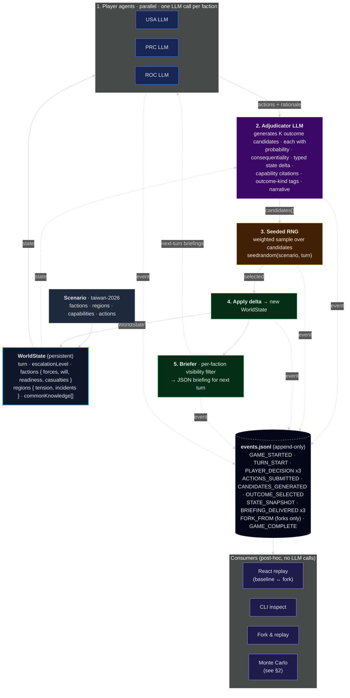
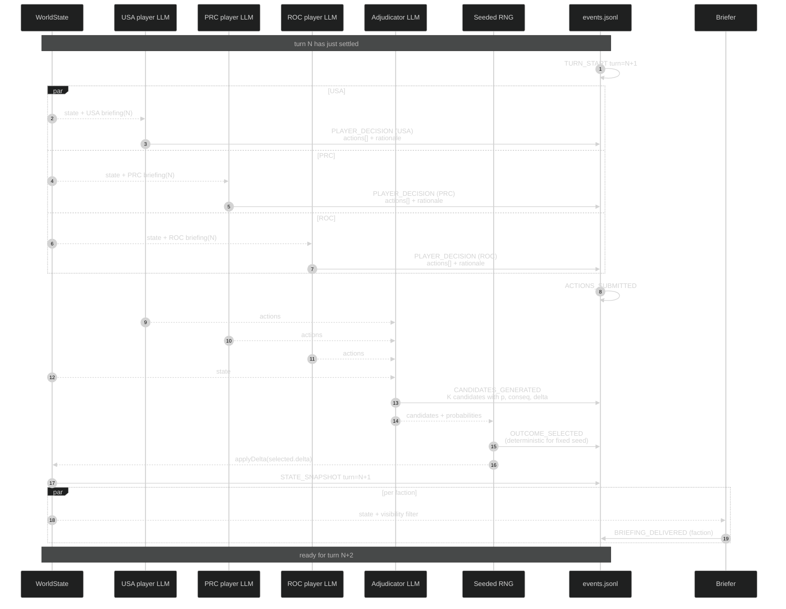
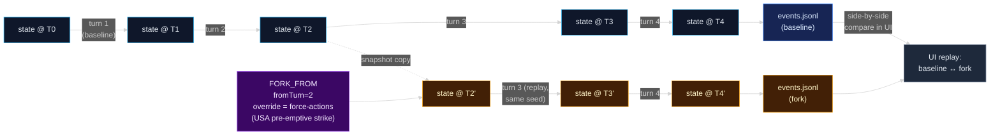
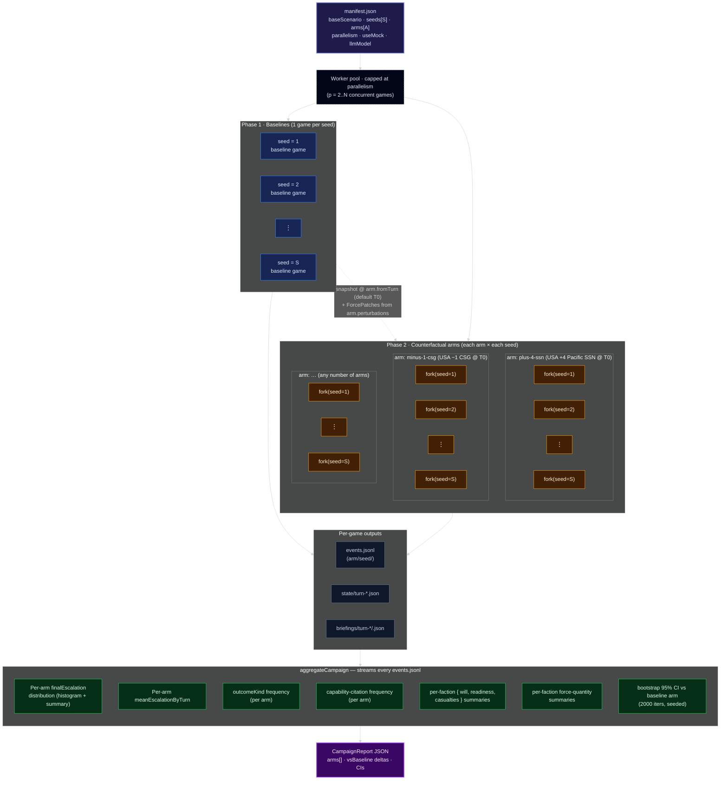
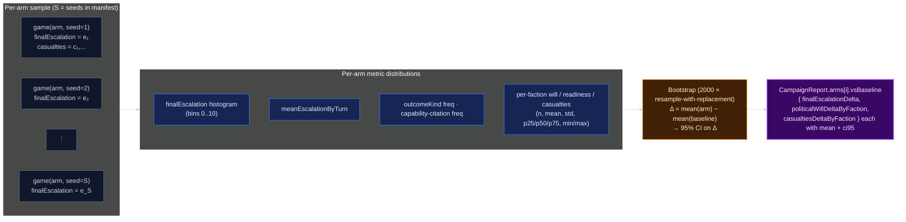

# Wargame Architecture

Two visual tours of how the system works:

1. **System overview** — what every game looks like, end to end.
2. **Monte Carlo** — how many games combine into a campaign and an
   apples-to-apples force-structure comparison.

All diagrams are [Mermaid](https://mermaid.js.org/) and render natively in
GitHub, GitLab, Obsidian, Cursor's markdown preview, etc. Pre-rendered
SVGs and 2x PNGs also live in [`diagrams/`](diagrams/) for embedding
elsewhere (slides, papers, posters):

| Diagram                              | Source                                          | SVG                                             | PNG                                             |
| ------------------------------------ | ----------------------------------------------- | ----------------------------------------------- | ----------------------------------------------- |
| System overview (component flow)     | [`.mmd`](diagrams/system-overview.mmd)          | [`.svg`](diagrams/system-overview.svg)          | [`.png`](diagrams/system-overview.png)          |
| Per-turn sequence                    | [`.mmd`](diagrams/turn-sequence.mmd)            | [`.svg`](diagrams/turn-sequence.svg)            | [`.png`](diagrams/turn-sequence.png)            |
| Counterfactual fork & replay         | [`.mmd`](diagrams/fork-replay.mmd)              | [`.svg`](diagrams/fork-replay.svg)              | [`.png`](diagrams/fork-replay.png)              |
| Monte Carlo campaign pipeline        | [`.mmd`](diagrams/campaign-pipeline.mmd)        | [`.svg`](diagrams/campaign-pipeline.svg)        | [`.png`](diagrams/campaign-pipeline.png)        |
| Monte Carlo aggregation & bootstrap  | [`.mmd`](diagrams/aggregation.mmd)              | [`.svg`](diagrams/aggregation.svg)              | [`.png`](diagrams/aggregation.png)              |

> The exported `.mmd` files set `flowchart: { htmlLabels: false }` so
> text is rendered as native SVG `<text>` (works in every viewer; the
> default `htmlLabels: true` only renders inside browsers because it
> uses `<foreignObject>` HTML).

Re-render after edits with:

```bash
# SVG (vector, scales infinitely)
npx -p @mermaid-js/mermaid-cli mmdc \
  -i docs/diagrams/<name>.mmd \
  -o docs/diagrams/<name>.svg \
  -b "#0b1220"

# PNG (raster, 2x scale for retina)
npx -p @mermaid-js/mermaid-cli mmdc \
  -i docs/diagrams/<name>.mmd \
  -o docs/diagrams/<name>.png \
  -b "#0b1220" -s 2
```

---

## 1. System overview

The engine is a pure function of `(scenario, seed, world_state, llm)`.
Each turn three player LLMs decide actions in parallel; an adjudicator
LLM proposes weighted outcome candidates; a seeded RNG samples one;
the typed delta is applied to the persistent `WorldState`; per-faction
briefings are produced. Every step is appended to a JSONL log so games
are queryable, replayable, and forkable.

### High-level data flow



### What happens inside a single turn



### Counterfactual fork & replay

A fork is just a new game whose `WorldState` is seeded from a baseline
snapshot at turn `T`, plus an optional override (`force-actions`,
`pin-candidate`, or initial-conditions perturbations such as
`+4 SSNs`). The same seed is used so any divergence between the two
runs is fully attributable to the override.



---

## 2. Monte Carlo campaigns

A single game with a single seed is an anecdote. Monte Carlo turns it
into evidence: pin a question (e.g. *"does +4 Pacific SSNs lower
expected escalation?"*), enumerate counterfactual **arms**, sweep many
**seeds** per arm, and aggregate the resulting distributions with
bootstrap confidence intervals against a chosen baseline arm.

### Campaign run pipeline



### What each arm contributes

For every arm × seed combination the engine produces a complete game.
The aggregator streams the JSONL log of each game and reduces it into
per-arm distributions. Bootstrap resampling then gives confidence
intervals on the *difference* between any non-baseline arm and the
baseline arm.



### Concrete example: the bundled `campaigns/demo`

The repo ships with a working demo manifest at `campaigns/demo/manifest.json`:

| arm           | perturbation                                     |
| ------------- | ------------------------------------------------ |
| `baseline`    | none                                             |
| `plus-4-ssn`  | `USA.ssn-pacific.quantityDelta = +4` at T0       |
| `minus-1-csg` | `USA.csg.quantityDelta = −1` at T0               |

With `seeds = 1..30` and `arms = 3` the runner produces **90 games**:

- **30** baseline games (Phase 1)
- **30** `plus-4-ssn` games (Phase 2, fork from each baseline)
- **30** `minus-1-csg` games (Phase 2, fork from each baseline)

After `npm run wargame -- campaign aggregate campaigns/demo` you get a
`report.json` whose `arms[i].vsBaseline` block answers the strategic
question with a CI:

```text
plus-4-ssn  vsBaseline.finalEscalationDelta = -0.43 (95% CI: -0.71 .. -0.18)
minus-1-csg vsBaseline.finalEscalationDelta = +0.62 (95% CI:  0.30 ..  0.95)
```

(Numbers are illustrative; actual values come from the run.)

---

## File map (where each component lives)

```
src/
├── engine/        # WorldState, JSONL log, RNG, turn loop, fork helpers
├── adjudicator/   # candidate-generating LLM agent + schemas + prompts
├── players/       # per-faction LLM player agent
├── comms/         # per-faction visibility-scoped briefer
├── fork/          # fork-and-replay machinery (snapshot + override)
├── campaign/      # Monte Carlo orchestration + aggregation
├── llm/           # OpenAI client, deterministic mock, factory
├── scenario/      # scenario loader and types
└── cli/           # thin CLI wrappers (new / run / fork / campaign / inspect)

scenarios/taiwan-2026/   # bundled scenario
games/<game-id>/         # per-game output (events.jsonl, state/, briefings/)
campaigns/<campaign-id>/ # per-campaign output (manifest.json, games/, report.json)
frontend/                # React/Vite replay viewer (consumes events.jsonl)
```
